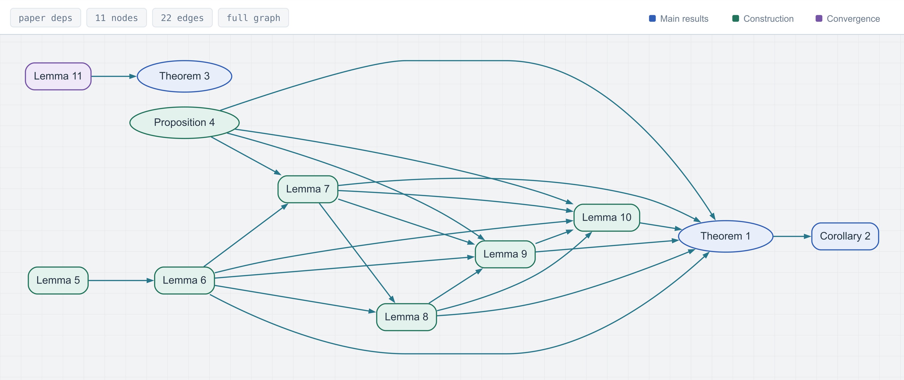

# DFP-Counterexample

This repository provides MATLAB code for the paper

*[A counterexample to global convergence of classical DFP under the standard
strong Wolfe conditions](https://arxiv.org/abs/2608.21708)*.

Uniform convexity alone does not guarantee global convergence of classical
DFP under the standard strong Wolfe conditions. The paper gives a
two-dimensional $C^2$ counterexample whose gradient norms converge to a
positive constant and whose iterates accumulate on a circle. It also proves
convergence under the standard weak Wolfe conditions for strongly convex
$C^2$ objective functions in two dimensions when the Hessian is locally
Lipschitz continuous near the initial level set.

The MATLAB code reproduces the numerical experiments in Sections 6.1–6.2:
the prescribed two-step recurrence, finite interpolation, and DFP/BFGS
comparisons using MATLAB's `fminunc` with DFP and BFGS updates.

Lean formalization:
https://github.com/optpku/ReasBook/tree/v4.32.0/ReasBook/Papers/DFP_wolfe_local/

Project on ReasLab:
https://reaslab.io/share/fqxVBj9GRaqFajkYxVtyXQR1210a9.MTc.YWxs

## Repository contents

| Path | Contents |
| --- | --- |
| `src/DFPExperiment.m` | Prescribed DFP recurrence and finite interpolation |
| `src/run_fminunc.m` | DFP/BFGS comparisons with MATLAB's built-in solver |
| `run_experiments.m` | Entry point for tests and paper experiments |
| `experiments/` | Experiment protocols, finite-function certification, and table and figure generation |
| `tests/` | Tests for the recurrence, interpolation, solver interface, and entry point |

## Installation

The reference experiments use MATLAB R2023a with Optimization Toolbox and
Statistics and Machine Learning Toolbox. The Symbolic Math Toolbox is also required for the exact
certificates (`certify` and `all`).

Download the repository or clone it:

```sh
git clone https://github.com/bqliu815/DFP-Counterexample.git
```

Open the repository root folder in MATLAB. Run the tests and a short example with:

```matlab
run_experiments('test');
run_experiments('smoke');
```

To run the DFP/BFGS comparison directly:

```matlab
addpath('src');
[objective, orbit] = DFPExperiment.finite(0.0025);
dfp = run_fminunc(objective, orbit, 'dfp', 5000);
bfgs = run_fminunc(objective, orbit, 'bfgs', 5000);
dfp.summary
bfgs.summary
```

The default comparison uses a linear change of variables to retain the
prescribed initial search direction. To use identity initialization in the
original coordinates, pass `'identity'` as the fifth argument. MATLAB's
internal line search and update safeguards are retained in both cases.

## Reproducing the numerical experiments

The complete protocol generates the data, checks the finite-function bounds
and recorded steps, then exports the tables and figures:

```matlab
run_experiments('all');
```

For the single-threaded setup used in the paper, run from the repository root:

```sh
matlab -singleCompThread -batch "run_experiments('all')"
```

Results are written to `results/paper/`, with `raw/`, `tables/`, and `figures/`
subdirectories. A second argument selects a different output directory.
See [docs/REPRODUCIBILITY.md](docs/REPRODUCIBILITY.md) for individual stages,
experimental parameters, and generated output files. Results are generated
locally and excluded from version control.

## Formal verification

The Lean 4 development covers the nonconvergence construction, its Hölder
regularity, the higher-dimensional and identity-initialized extensions, and
planar convergence under a locally Lipschitz Hessian. The
[formalization README](https://github.com/optpku/ReasBook/blob/v4.32.0/ReasBook/Papers/DFP_wolfe_local/README.md)
describes the scope and lists the main theorem declarations.

The following table links selected paper results to their Lean declarations.

| Paper reference | Lean formalization |
| --- | --- |
| Theorem 1 | [Strong Wolfe counterexample with a globally $1/2$-Hölder Hessian](https://github.com/optpku/ReasBook/blob/cfabd0d50e7d1e3007a755878841072b0ea00063/ReasBook/Papers/DFP_wolfe_local/ReasLib/Optimization/DFP/WolfeCounterexample/HolderSharpness.lean#L406) |
| Corollary 2 | [Identity initialization with Hölder regularity](https://github.com/optpku/ReasBook/blob/cfabd0d50e7d1e3007a755878841072b0ea00063/ReasBook/Papers/DFP_wolfe_local/ReasLib/Optimization/DFP/WolfeCounterexample/Holder.lean#L107) |
| Theorem 3 | [Planar convergence under weak Wolfe conditions](https://github.com/optpku/ReasBook/blob/cfabd0d50e7d1e3007a755878841072b0ea00063/ReasBook/Papers/DFP_wolfe_local/DFPWolfe/Main.lean#L198); [Planar convergence under strong Wolfe conditions](https://github.com/optpku/ReasBook/blob/cfabd0d50e7d1e3007a755878841072b0ea00063/ReasBook/Papers/DFP_wolfe_local/DFPWolfe/Main.lean#L223) |
| Lemma 11 | [Secant degeneration and vanishing smallest eigenvalue](https://github.com/optpku/ReasBook/blob/cfabd0d50e7d1e3007a755878841072b0ea00063/ReasBook/Papers/DFP_wolfe_local/ReasLib/Optimization/DFP/SecantDegeneration.lean#L726) |
| Equation (73) | [Sharpness of the $1/2$-Hölder exponent](https://github.com/optpku/ReasBook/blob/cfabd0d50e7d1e3007a755878841072b0ea00063/ReasBook/Papers/DFP_wolfe_local/ReasLib/Optimization/DFP/WolfeCounterexample/HolderSharpness.lean#L406) |

The theorem map covers all numbered results. Click the image to open the
interactive paper view.

[](https://optpku.github.io/ReasBook/theorem-maps/papers/dfp_wolfe_local/?view=paper)

Interactive theorem map:
https://optpku.github.io/ReasBook/theorem-maps/papers/dfp_wolfe_local/?view=paper

A short walkthrough shows how to compare Theorem 1 with its Lean statement,
inspect the strong Wolfe conditions, and navigate definitions in ReasLab:

https://github.com/user-attachments/assets/a37e11f0-5c68-4265-96de-7f875de9c0c3

The project uses Lean 4.32.0 and mathlib 4.32.0. With Lean's `elan` toolchain
manager installed, the following commands check the source snapshot used
here:

```sh
git clone --branch v4.32.0 https://github.com/optpku/ReasBook.git
cd ReasBook
git checkout cfabd0d50e7d1e3007a755878841072b0ea00063
cd ReasBook
lake exe cache get
lake lean Papers/DFP_wolfe_local/Paper.lean
```

`Paper.lean` imports the paper's public theorem interface. The last command
builds the required modules and checks this entry point.

The formalization is distributed under the Apache 2.0 License in ReasBook.

## Citation

If you use this code, please cite:

```bibtex
@misc{LiuEtAl2026DFP,
  author = {Benqi Liu and Zichen Wang and Zaiwen Wen and
            Liwei Zhang and Yaxiang Yuan},
  title  = {A counterexample to global convergence of classical {DFP}
            under the standard strong {Wolfe} conditions},
  year   = {2026},
  eprint = {2608.21708},
  archivePrefix = {arXiv},
  primaryClass = {math.OC},
  doi    = {10.48550/arXiv.2608.21708},
  url    = {https://arxiv.org/abs/2608.21708}
}
```

Machine-readable citation metadata is provided in [CITATION.cff](CITATION.cff).

## Authors and contact

- Benqi Liu: [bqliu@pku.edu.cn](mailto:bqliu@pku.edu.cn)
- Zichen Wang: [zichenwang25@stu.pku.edu.cn](mailto:zichenwang25@stu.pku.edu.cn)
- Zaiwen Wen: [wenzw@pku.edu.cn](mailto:wenzw@pku.edu.cn)
- Yaxiang Yuan: [yyx@lsec.cc.ac.cn](mailto:yyx@lsec.cc.ac.cn)
- Liwei Zhang: [zhanglw@mail.neu.edu.cn](mailto:zhanglw@mail.neu.edu.cn)

## License

Code is released under the [MIT License](LICENSE).
