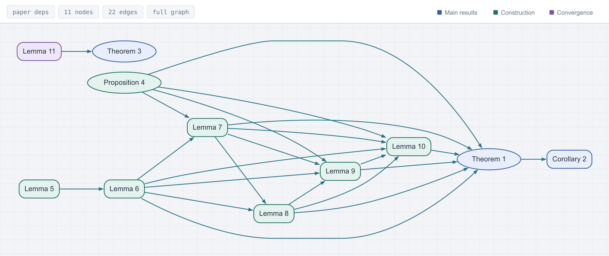

# DFP-Counterexample

This repository provides MATLAB code for the paper

*[A counterexample to global convergence of classical DFP under the standard
strong Wolfe conditions](https://arxiv.org/abs/2608.21708)*.

The code follows the revised manuscript; the linked arXiv preprint describes
the earlier construction.

Uniform convexity alone does not guarantee global convergence of classical
DFP under the standard strong Wolfe conditions. The paper gives a
two-dimensional $C^2$ counterexample whose gradient norms converge to a
positive constant and whose iterates accumulate on a circle. It also proves
convergence under the standard weak Wolfe conditions for strongly convex
$C^2$ objective functions in two dimensions when the Hessian is locally
Lipschitz continuous near the initial level set.

The MATLAB code implements the polar construction and reproduces the numerical
experiments in Sections 7.1–7.2 of the revised manuscript. The prescribed
two-step recurrence is evaluated directly. The DFP and BFGS
comparisons use MATLAB's `fminunc` on fixed finite objective functions
formed by local interpolation.

Lean formalization:
https://github.com/optpku/ReasBook/tree/cfabd0d50e7d1e3007a755878841072b0ea00063/ReasBook/Papers/DFP_wolfe_local/

Project on ReasLab:
https://reaslab.io/share/fqxVBj9GRaqFajkYxVtyXQR1210a9.MTc.YWxs

## Repository contents

| Path | Contents |
| --- | --- |
| `polar/PolarDFP.m` | Polar recurrence, finite interpolation, and DFP/BFGS solvers |
| `polar/run_polar_experiments.m` | Numerical experiments and exact certificates |
| `polar/certify_finite.m` | Support separation and global Hessian bounds |
| `polar/make_polar_figures.m` | Figure generation, including the DFP detail inset |
| `run_experiments.m` | Entry point for tests and paper experiments |
| `tests/` | Tests of the recurrence, interpolation, solver, and entry point |

## Installation

The reference experiments use MATLAB R2025a Update 1 with Optimization Toolbox and
Statistics and Machine Learning Toolbox. Symbolic Math Toolbox is also
required for the exact certificates (`certify` and `all`).

Download the repository or clone it:

```sh
git clone https://github.com/bqliu815/DFP-Counterexample.git
```

Open the repository root folder in MATLAB. Run the tests and a short example with:

```matlab
run_experiments('test');
run_experiments('smoke');
```

To run the DFP/BFGS comparison directly:

```matlab
addpath('polar');
orbit = PolarDFP.orbit(4002, 400^3, 1.03);
objective = PolarDFP.finite(orbit);
dfp = PolarDFP.solve(objective, orbit, 'dfp', 5000);
bfgs = PolarDFP.solve(objective, orbit, 'bfgs', 5000);
dfp.summary
bfgs.summary
```

Both methods use the same linear change of variables to retain the initial
search direction determined by the prescribed inverse Hessian approximation.
MATLAB's internal line search and update safeguards are retained.

## Reproducing the numerical experiments

The complete run generates the trajectories, certifies the Hessian bounds,
and exports the figures:

```matlab
run_experiments('all');
```

For the single-threaded setup used in the paper, run from the repository root:

```sh
matlab -singleCompThread -batch "run_experiments('all')"
```

Results are written to `results/paper/`. JSON summaries contain the quantities
reported in the tables. A second argument selects a different output directory.
See [docs/REPRODUCIBILITY.md](docs/REPRODUCIBILITY.md) for individual stages,
experimental parameters, and generated output files. Results are generated
locally and excluded from version control.

## Formal verification

The existing Lean 4 formalization covers the earlier nonconvergence construction, its Hölder
regularity, extensions to higher dimensions and identity initialization, and
planar convergence with a locally Lipschitz continuous Hessian. The
[formalization README](https://github.com/optpku/ReasBook/blob/cfabd0d50e7d1e3007a755878841072b0ea00063/ReasBook/Papers/DFP_wolfe_local/README.md)
describes the scope and lists the main theorem declarations.

The polar construction in Sections 3–4 and its near-identity Hessian
strengthening have not yet been formalized. The counterexample links
below refer to the earlier construction. The table uses the current
manuscript's numbering; the theorem map and walkthrough retain the
earlier numbering.

| Revised manuscript reference and scope | Lean formalization |
| --- | --- |
| Theorem 1: earlier counterexample construction | [Strong Wolfe counterexample with a globally $1/2$-Hölder Hessian](https://github.com/optpku/ReasBook/blob/cfabd0d50e7d1e3007a755878841072b0ea00063/ReasBook/Papers/DFP_wolfe_local/ReasLib/Optimization/DFP/WolfeCounterexample/HolderSharpness.lean#L406) |
| Corollary 2: extension of the earlier construction | [Identity initialization with Hölder regularity](https://github.com/optpku/ReasBook/blob/cfabd0d50e7d1e3007a755878841072b0ea00063/ReasBook/Papers/DFP_wolfe_local/ReasLib/Optimization/DFP/WolfeCounterexample/Holder.lean#L107) |
| Theorem 3 (proof in Section 5) | [Planar convergence under weak Wolfe conditions](https://github.com/optpku/ReasBook/blob/cfabd0d50e7d1e3007a755878841072b0ea00063/ReasBook/Papers/DFP_wolfe_local/DFPWolfe/Main.lean#L198); [Planar convergence under strong Wolfe conditions](https://github.com/optpku/ReasBook/blob/cfabd0d50e7d1e3007a755878841072b0ea00063/ReasBook/Papers/DFP_wolfe_local/DFPWolfe/Main.lean#L223) |
| Lemma 7 (historical Lean numbering: Lemma 11) | [Secant degeneration and vanishing smallest eigenvalue](https://github.com/optpku/ReasBook/blob/cfabd0d50e7d1e3007a755878841072b0ea00063/ReasBook/Papers/DFP_wolfe_local/ReasLib/Optimization/DFP/SecantDegeneration.lean#L726) |
| Hessian Hölder sharpness for the earlier construction | [Sharpness of the $1/2$-Hölder exponent](https://github.com/optpku/ReasBook/blob/cfabd0d50e7d1e3007a755878841072b0ea00063/ReasBook/Papers/DFP_wolfe_local/ReasLib/Optimization/DFP/WolfeCounterexample/HolderSharpness.lean#L406) |

Click the theorem map to open the interactive paper view.

[](https://optpku.github.io/ReasBook/theorem-maps/papers/dfp_wolfe_local/?view=paper)

Interactive theorem map:
https://optpku.github.io/ReasBook/theorem-maps/papers/dfp_wolfe_local/?view=paper

A short walkthrough compares the earlier Theorem 1 with its Lean statement,
inspects the strong Wolfe conditions, and navigates definitions in ReasLab:

https://github.com/user-attachments/assets/05377f12-3f84-4915-98bf-e1aa71c52507

The formalization uses Lean 4.32.0 and mathlib 4.32.0. With Lean's `elan`
toolchain manager installed, run:

```sh
git clone --branch v4.32.0 https://github.com/optpku/ReasBook.git
cd ReasBook
git checkout cfabd0d50e7d1e3007a755878841072b0ea00063
cd ReasBook
lake exe cache get
lake lean Papers/DFP_wolfe_local/Paper.lean
```

`Paper.lean` imports the paper's public theorem interface. The last command
builds the required modules and checks this entry point.

The formalization is distributed under the Apache 2.0 License in ReasBook.

## Citation

If you use this code, please cite:

```bibtex
@misc{LiuEtAl2026DFP,
  author = {Benqi Liu and Zichen Wang and Zaiwen Wen and
            Yaxiang Yuan and Liwei Zhang},
  title  = {A counterexample to global convergence of classical {DFP}
            under the standard strong {Wolfe} conditions},
  year   = {2026},
  eprint = {2608.21708},
  archivePrefix = {arXiv},
  primaryClass = {math.OC},
  doi    = {10.48550/arXiv.2608.21708},
  url    = {https://arxiv.org/abs/2608.21708}
}
```

Machine-readable citation metadata is provided in [CITATION.cff](CITATION.cff).

## Authors and contact

- Benqi Liu: [bqliu@pku.edu.cn](mailto:bqliu@pku.edu.cn)
- Zichen Wang: [zichenwang25@stu.pku.edu.cn](mailto:zichenwang25@stu.pku.edu.cn)
- Zaiwen Wen: [wenzw@pku.edu.cn](mailto:wenzw@pku.edu.cn)
- Yaxiang Yuan: [yyx@lsec.cc.ac.cn](mailto:yyx@lsec.cc.ac.cn)
- Liwei Zhang: [zhanglw@mail.neu.edu.cn](mailto:zhanglw@mail.neu.edu.cn)

## License

Code is released under the [MIT License](LICENSE).
